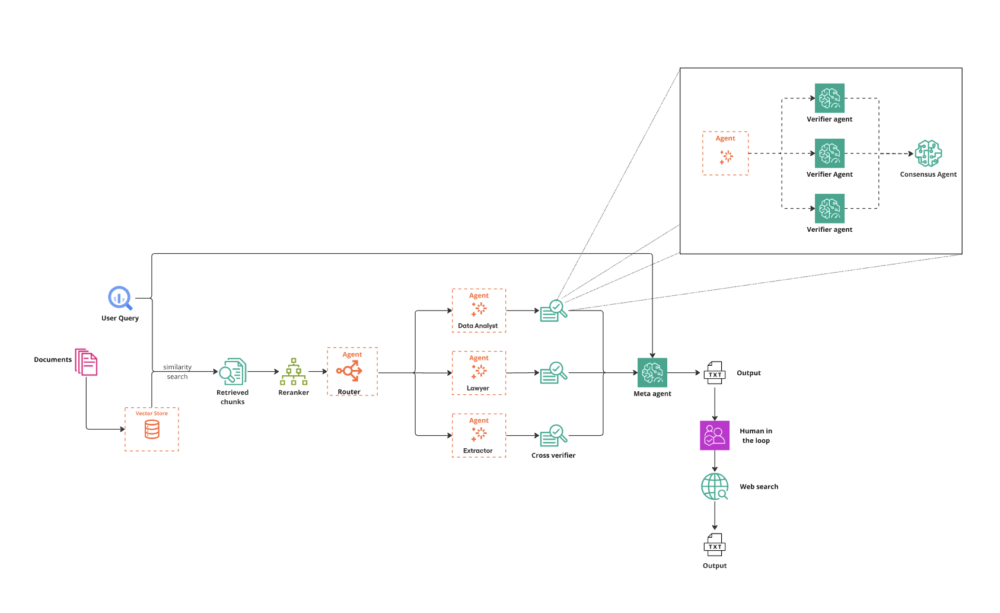

# agentic_rag
this is an Multi Agentic RAG pipeline to decipher important information from finance documents specially 10-k reports and can answer all the queries with great precision.
---

# Project Setup

- **Python version**: 3.12.4

Ensure you have Python 3.12.4 installed on your system. You can verify your Python version by running:
```bash
python --version
```

```bash
export WORKSPACE_DIR="agent_workspace"
```
```bash
export TESSDATA_PREFIX=/usr/share/tesseract-orc
```
```bash
export TESSDATA_PREFIX=/usr/share/tesseract-ocr/4.00/tessdata
```
```bash
export OPENAI_API_KEY=<YOUR_OPENAI_API_KEY>
```
update above in your ~/.bashrc or your ~/.zshrc


```bash
pip install gradio loguru openai python-dotenv requests swarms tqdm pathway
pip install -U pathway[xpack-llm-docs]
```
additionally also install above library
```bash
def list_available_cpus() -> List[int]:
    """
    Lists all available CPU cores.

    Returns:
        List[int]: A list of available CPU core indices.

    Raises:
        RuntimeError: If no CPUs are found.
    """
    try:
        cpu_count = psutil.cpu_count(logical=False)
        cpu_count = cpu_count * 2
        if cpu_count is None or cpu_count <= 0:
            raise RuntimeError("No CPUs found.")
        logger.info(f"Available CPUs: {list(range(cpu_count))}")
        return list(range(cpu_count))
    except Exception as e:
        logger.error(f"Error listing CPUs: {e}")
        raise
```
in clusterops main.py line-49 add cpu_count = cpu_count*2
**NOTE:** clusterops vesion 0.0.6

## Installation

To install the necessary dependencies, run:
```bash
pip install -r requirements.txt
```
```bash
python ui.py
```


## Usage Guidelines

2. **Check your browser**:
   ```bash
   http://127.0.0.1:7860
   ```

## Pipeline




## References

1. Akari Asai, Zeqiu Wu, Yizhong Wang, Avirup Sil, Hannaneh Hajishirzi, *Self-RAG: Learning to Retrieve, Generate, and Critique through Self-Reflection*. ICLR 2024: [https://arxiv.org/abs/2310.11511](https://arxiv.org/abs/2310.11511)

2. Documentation on Multiagent Collaborations using routers: [https://docs.swarms.world/en/latest/swarms/concept/why/](https://docs.swarms.world/en/latest/swarms/concept/why/)

3. Anthropic. Contextual Retrieval article: [https://www.anthropic.com/news/contextual-retrieval](https://www.anthropic.com/news/contextual-retrieval)

4. Ragas documentation on evaluation metrics: [https://docs.ragas.io/en/latest/concepts/metrics/available_metrics/answer_relevance/](https://docs.ragas.io/en/latest/concepts/metrics/available_metrics/answer_relevance/)

5. NVIDIA. Guide on guardrails: [https://docs.nvidia.com/nemo/guardrails/introduction.html](https://docs.nvidia.com/nemo/guardrails/introduction.html)
